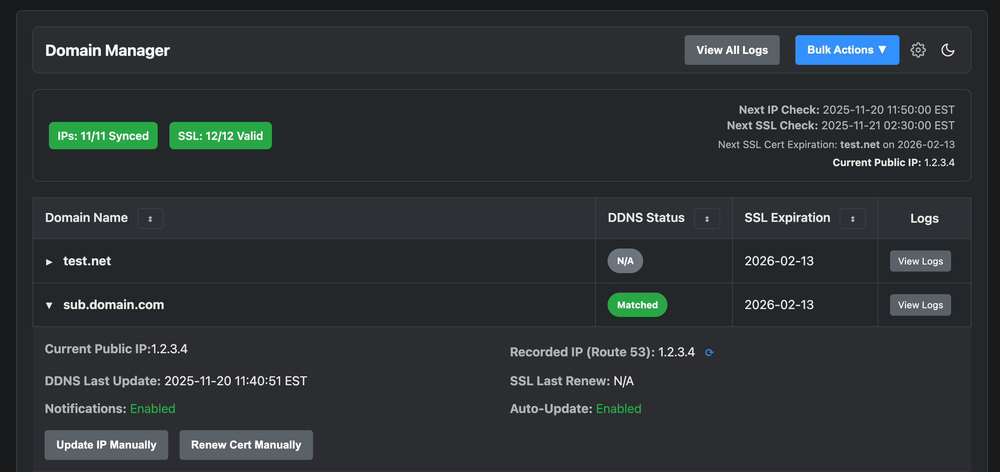

# Domain Manager

A self-hosted, automated DDNS & SSL Certificate manager for AWS Route 53.

This application provides a simple web dashboard to monitor and manage your domain records. It automatically updates your AWS Route 53 'A' records to match your home's dynamic public IP and uses Let's Encrypt to create and renew SSL certificates for your services.

**Version:** `v0.4`
**GitHub:** [thebronway/domain-manager](https://github.com/thebronway/domain-manager)
**Docker Hub:** [thebronway/domain-manager](https://hub.docker.com/r/thebronway/domain-manager)

---

---

## Features

* **Dynamic DNS (DDNS):** Automatically checks your public IP and updates AWS Route 53 A-records if they change.
* **SSL Management:** Wraps Certbot to handle creation and renewal of certificates using the DNS-01 challenge (perfect for Wildcards).
* **Web Dashboard:** A clean, responsive UI to view the status of all your domains at a glance.
* **Settings UI:** Configure everything—domains, notifications, timezones, and log retention—directly from the browser. No container restarts required!
* **Notifications:** Get alerts via Discord, Slack, Telegram, Email (SMTP), and more when IPs update or certs renew.
* **Mobile Friendly:** Fully responsive design that works great on your phone.

## Why I Built This

I needed a simple way to keep my home server's IP in sync with AWS and ensure my SSL certificates never expired, without relying on scripts. I wanted a clean UI to see exactly what was happening, when updates occurred, and to get notified if something went wrong.

This project was developed with AI assistance to help build, refactor, and enhance features.

## Important Note on SSL Certificates

**This application is designed to manage the full lifecycle of your certificates.**

* It can **only** renew and manage certificates that it created itself.
* It **cannot** import or manage existing certificates you generated manually or via another tool.
* If you have existing certs, you should let this app generate new ones to ensure seamless auto-renewal.

## Important Note on Authentication

**This app does not have built-in login functionality.** You must manage your own authentication. It is strongly recommended to run this container behind a reverse proxy (like Nginx, Traefik, or Cloudflare Tunnel) and enforce Basic Auth or SSO (Authelia/Authentik) to secure the dashboard.

## Quick Start

### 1. Prerequisites
* A domain managed by **AWS Route 53**.
* An AWS IAM User with permissions to modify Route 53.

### 2. Run with Docker
The easiest way to get started is using Docker.

```bash
docker run -d \\
  --name domain-manager \\
  -p 8080:8080 \\
  -v $(pwd)/config:/config \\
  -v $(pwd)/certs:/certs \\
  -v $(pwd)/logs:/logs \\
  -e AWS_ACCESS_KEY_ID="YOUR_AWS_ACCESS_KEY" \\
  -e AWS_SECRET_ACCESS_KEY="YOUR_AWS_SECRET_KEY" \\
  --restart unless-stopped \\
  thebronway/domain-manager:latest
```

### 3. Configure
1.  Open `http://localhost:8080` in your browser.
2.  Click the **Settings** gear icon.
3.  Add your domains, enable the features you want (DDNS, SSL, etc.), and set up notifications.
4.  Click **Save Changes**.

## Volumes

| Volume | Description |
| :--- | :--- |
| `/config` | Stores `settings.json` and application state. **Mount this to persist settings.** |
| `/certs` | Stores Let's Encrypt certificates. **Mount this to share certs with your other containers (Nginx, Traefik, etc.).** |
| `/logs` | Stores application logs. Useful for debugging. |

## Environment Variables

| Variable | Description | Required |
| :--- | :--- | :--- |
| `AWS_ACCESS_KEY_ID` | Your AWS Access Key. | Yes |
| `AWS_SECRET_ACCESS_KEY` | Your AWS Secret Key. | Yes |
| `DEMO_MODE` | Set to `true` to run with fake data (no AWS connection). | No 