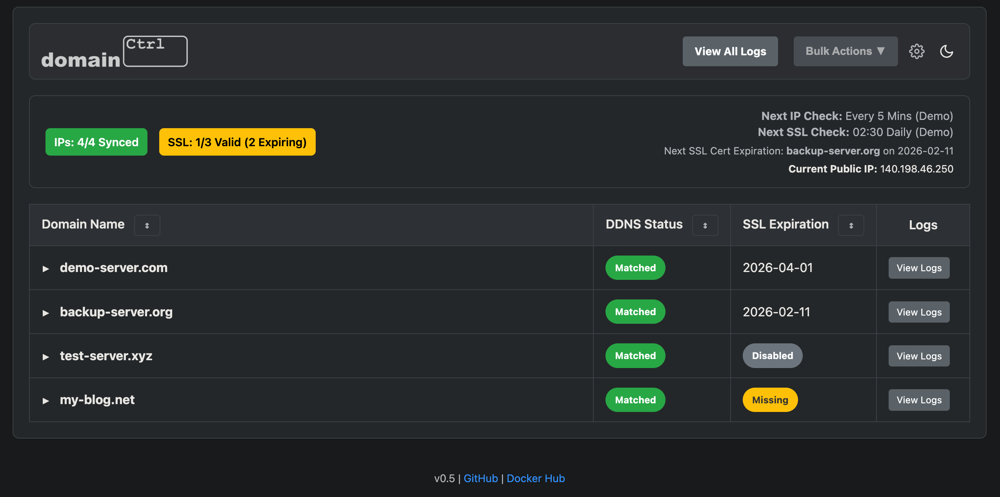
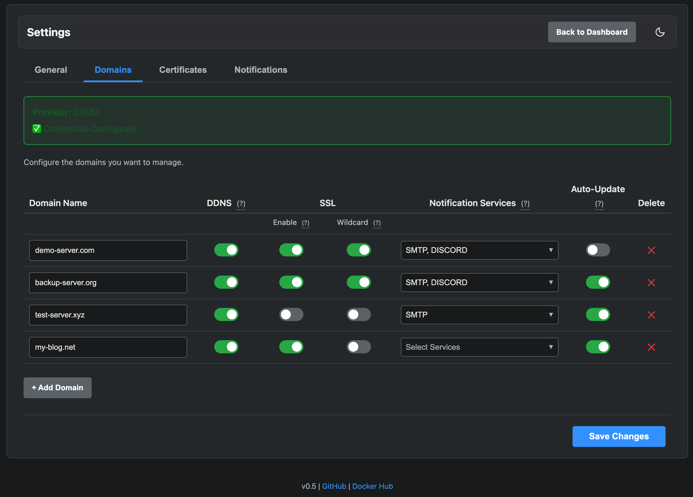

# domainCtrl

A Self-Hosted, Automated DDNS & SSL Certificate Manager. 

> **Note:** This app is nearing is in active development and should be used with caution.

> **Note:** Currently domainCtrl only supports AWS Route 53 (more providers coming soon).

**domainCtrl** provides a simple web dashboard to monitor and manage your domain records. It automatically updates your DNS 'A' records to match your home's dynamic public IP and uses Let's Encrypt to create and renew SSL certificates for your services.

**Version:** `v0.5`  
**GitHub:** [thebronway/domainCtrl](https://github.com/thebronway/domainCtrl)  
**Docker Hub:** [thebronway/domainctrl](https://hub.docker.com/r/thebronway/domainctrl)

## Screenshots





## Features

* **Dynamic DNS (DDNS):** Automatically checks your public IP and updates DNS records if they change.
* **SSL Management:** Wraps Certbot to handle creation and renewal of certificates using the DNS-01 challenge (Wildcard supported).
* **Web Dashboard:** A clean, responsive UI to view the status of all your domains at a glance.
* **Settings UI:** Configure domains, notifications, timezones, and log retention directly from the browser.
* **Notifications:** Get alerts via Discord, Slack, Telegram, Email (SMTP), and more.
* **Mobile Friendly:** Fully responsive design.

## Important Notes

1.  **SSL Lifecycle:** This app manages the full lifecycle of certificates. It can only renew certs it created. Existing certs should be replaced by ones generated here for auto-renewal.
2.  **Authentication:** **This app has no login.** You MUST run this behind a reverse proxy (Nginx, Traefik, etc.) with Basic Auth or SSO to secure the dashboard.

## Quick Start

### 1. Prerequisites
* A domain managed by a supported provider (currently **AWS Route 53**).
* API credentials with permissions to modify DNS records.

### 2. Run with Docker

```bash
docker run -d \\
  --name domainctrl \\
  -p 8080:8080 \\
  -v $(pwd)/config:/config \\
  -v $(pwd)/certs:/certs \\
  -v $(pwd)/logs:/logs \\
  -e PROVIDER=Route53 \\
  -e AWS_ACCESS_KEY_ID="YOUR_KEY" \\
  -e AWS_SECRET_ACCESS_KEY="YOUR_SECRET" \\
  -e TZ=America/New_York \\
  --restart unless-stopped \\
  thebronway/domainctrl:latest
```

### 3. Configure
1.  Open `http://localhost:8080`.
2.  Go to **Settings**.
3.  Add domains and toggle features (DDNS, SSL, Notifications).
4.  Save Changes.

## Volumes

| Volume | Description |
| :--- | :--- |
| `/config` | Stores settings and state. **Mount to persist configuration.** |
| `/certs` | Stores SSL certificates. **Mount to share with your reverse proxy.** |
| `/logs` | Stores application logs. |

## Environment Variables

The application is configured primarily via the `PROVIDER` variable.

| Variable | Description | Required |
| :--- | :--- | :--- |
| `PROVIDER` | The DNS provider to use. Currently supports: `Route53`. | **Yes** |
| `TZ` | Timezone for logs and UI (e.g., `America/New_York`). | No |

### Provider-Specific Variables

**If `PROVIDER=Route53`:**

| Variable | Description | Required |
| :--- | :--- | :--- |
| `AWS_ACCESS_KEY_ID` | Your AWS Access Key. | Yes |
| `AWS_SECRET_ACCESS_KEY` | Your AWS Secret Key. | Yes |

### Optional Notification Variables

Secrets for notifications can be configured in the Settings UI or passed as environment variables.

| Variable | Description |
| :--- | :--- |
| `SMTP_USER` | Username for SMTP authentication. |
| `SMTP_PASS` | Password for SMTP authentication. |
| `DISCORD_WEBHOOK_URL` | Discord Webhook URL. |
| `SLACK_WEBHOOK_URL` | Slack Webhook URL. |
| `TELEGRAM_URL` | Apprise-format Telegram URL (e.g., `tgram://bot_token/chat_id`). |
| `MSTEAMS_WEBHOOK_URL` | Microsoft Teams Webhook URL. |
| `PUSHOVER_URL` | Apprise-format Pushover URL. |
| `GCHAT_WEBHOOK_URL` | Google Chat Webhook URL. |